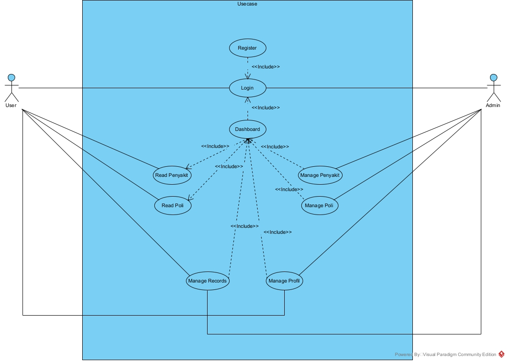
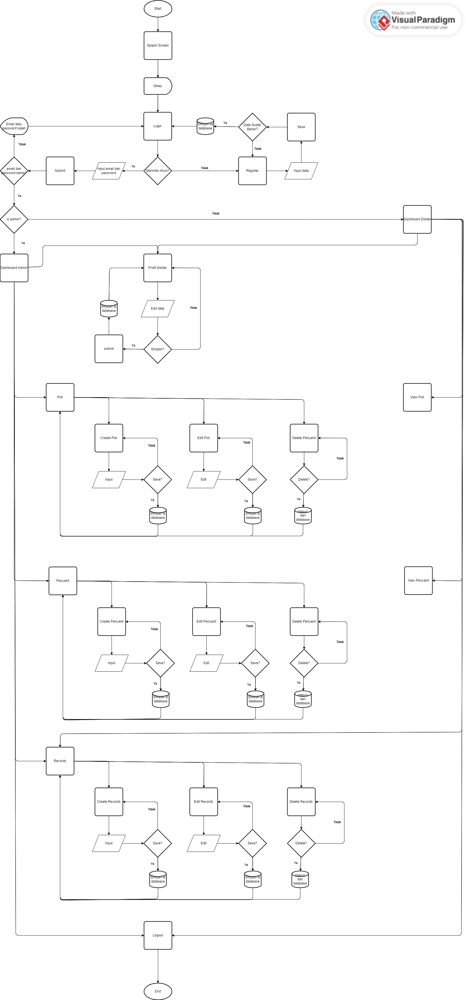

# MediRecs

Aplikasi MediRecs adalah aplikasi yang berfungsi untuk membuat data rekam medis dari pasien yang dimana admin membuat records pasien yang berisi list poli dan list penyakit dari pasien

   

## user

1. auth user (dokter)
2. admin

  

## fitur

##### A. admin
1. Login,
2. CRUD list Poli,
3. CRUD list Penyakit,
4. CRUD Records Pasien,
5. Read/Delete Profil Dokter,
6. Logout

##### B. auth user (dokter)
1. Register,
2. Login,
3. Read Penyakit,
4. Read Poli,
5. CRUD Records Pasien,
6. Read/Update Profil Dokter,
7. Logout

  

## flow

#### A. admin
Login>CRUD list Poli >CRUD list Penyakit> CRUD Records Pasien> Read/Delete Profil Dokter>Logout

#### B. auth user (dokter)
Register> Login> Read Penyakit> Read Poli> CRUD Records Pasien> Logout
 
 
## UML

##### 1. 

 
 
 
##### 2.
